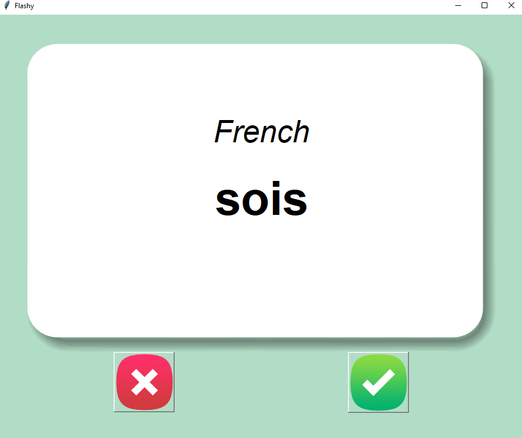

Flash Card
-
Descriptions: The app is a flash card that can help you study.

Requirements:
- UI created by TK()
- Use Panda to pull the data from a csv list and load it in the flash card
- Use random to pull a word
- Create a new list by removing the words that we already mastered
- Save the new list to csv and we start by reading the new list if it exists

