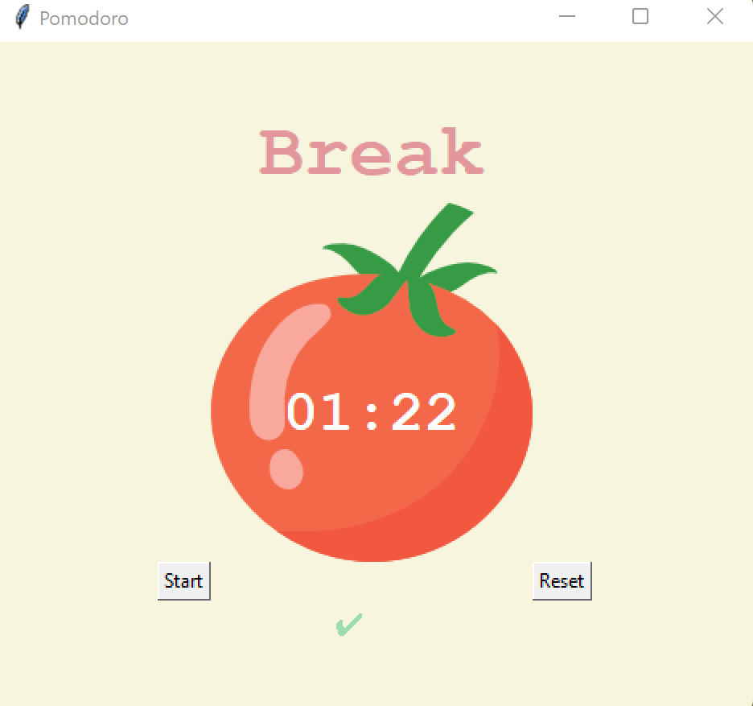

# Pomodoro Timer

### Requirements
- Use tkinter to design a timer
- Title, display what session it is
- Clock timer, count down by second
- Start button, start the timer
- Reset button, stop the timer, reset everything
- When completing 1 work session add a check mark

